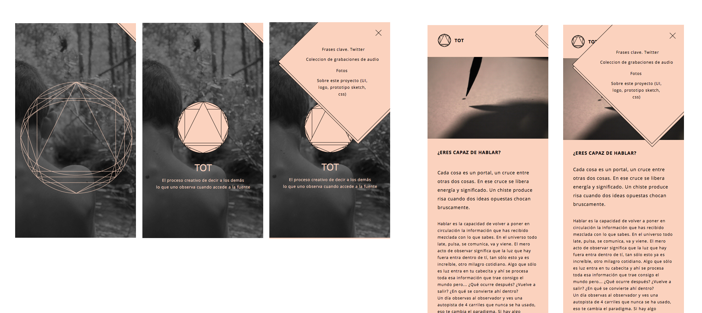

# Tot

### Make the Web Fun Again
Introducing TOT, a new idea around making website creation simple again. TOT flexibly works with many formats and is ideal for blogs, docs, portfolios and much more. TOT’s speed fosters creativity and makes building a website fun again.
Technically speaking, TOT is a static site generator. This means that, unlike systems like WordPress, Ghost and Drupal, which run on your web server expensively building a page every time a visitor requests one, TOT does the building when you create your content. Since websites are viewed far more often than they are edited, TOT is optimized for website viewing while providing a great writing experience.
This is essential when you are designing websites, but also very useful when creating content.

Clean and fast static site handcrafted with :sparkling_heart: by **Sergio Forés** - Fullstack Web Designer

 [ Portfolio ](http://t0t.github.io/sergiofores/) | [ Repositories ](https://github.com/t0t/) | [ Linkedin ](https://www.linkedin.com/in/sergiofores/) | [ Tumblr ](http://www.tumblr.com/t0tfotos) | [ Facebook ](https://www.facebook.com/T0T-156415467869146/) | [ @t0tinspire ](https://twitter.com/t0tinspire/)
 [ Portfolio ](http://t0t.github.io/sergiofores/) | [ Repositories ](https://github.com/t0t/) | [ Linkedin ](https://www.linkedin.com/in/sergiofores/) | [ Tumblr ](http://www.tumblr.com/t0tfotos) | [ Facebook ](https://www.facebook.com/T0T-156415467869146/) | [ Codepen ](http://codepen.io/t0t/)

## Acerca de este proyecto
- TOT tiene distintas ramas, distintas versiones paralelas por lo que explora nuevas alternativas que pueden volver a unirse.
- Su contenido se muestra en forma de cápsulas que se van añadiendo. Cada cápsula contiene:
  - un texto muy corto y sintético que habla de una idea
  - Una (o varias fotos)
  - Un audio en el que expreso algo
- La temática es diversa mezclando el ámbito de lo personal con el profesional.
- TOT busca realizar los dones y talentos que me fueron dados al nacer, todos los tenemos, los míos son tener una gran capacidad de observación, comprender y transmitir.

## developed with...
- Jade template Engine. Template Engines are tools that help us break HTML code into smaller pieces that we can reuse across multiple HTML files. They also give you the power to feed data into variables that help you simplify your code.
- Gulp as static site generator
  - gulp-sourcemaps
  - gulp-autoprefixer
  - gulp-gh-pages
  - browser-sync
  - gulp-concat
  - gulp-image
  - gulp-uglify
  - gulp-babel
  - gulp-data
  - gulp-sass
  - gulp-jade
  - del
- Preprocessed in Sass
- Git Control Version
- Plain Javascript
- NPM Modules

## features
- Naming convention in mind
- No third part libraries
- SVG Icon Symbols
- CSS Components
- Mobile first
- Mantainable
- Lightweight
- Responsive
- ES6 Ready
- Scalable
- AJAX

## todo list
 - [ ] Implementar API Twitter
 - [ ] Use Svgomg https://jakearchibald.github.io/svgomg/
 - [x] Refactorize, refactorize and refactorize
 - [ ] Use page.js for routing?
 - [ ] Add http://formspree.io/
 - [ ] Contentful or WP-API
 - [x] Add EU Cookie Law
 - [ ] Separate Gulp tasks into multiple files
 - [ ] Mirar el tema de implementar sistema de posts estáticos en yml, markup o JSON...
 - [ ] Implementar Html5 API's Audio/Video - Miro Converter => html5please.com | archive.org Player: mediaelementjs.com
