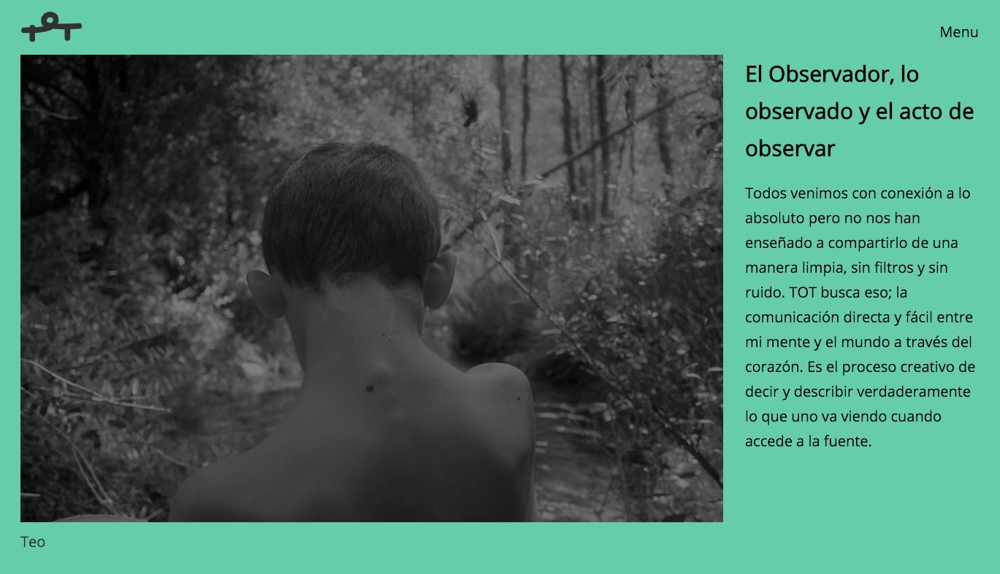

# Tot

Clean and fast static site handcrafted with :sparkling_heart: by **Sergio Forés** - Fullstack Web Designer

 [ Portfolio ](http://t0t.github.io/sergiofores/) | [ Repositories ](https://github.com/t0t/) | [ Linkedin ](https://www.linkedin.com/in/sergiofores/) | [ Tumblr ](http://www.tumblr.com/t0tfotos) | [ Facebook ](https://www.facebook.com/T0T-156415467869146/) | [ @t0tinspire ](https://twitter.com/t0tinspire/)

## developed with...
- Jade template system
- Gulp tasks
  - gulp-sourcemaps
  - gulp-autoprefixer
  - gulp-gh-pages
  - browser-sync
  - gulp-concat
  - gulp-image
  - gulp-uglify
  - gulp-babel
  - gulp-data
  - gulp-sass
  - gulp-jade
  - del
- Preprocessed in Sass
- Git Control Version
- Plain Javascript
- NPM Modules

## features
- No third part libraries
- SVG Icon Symbols
- CSS Components
- Mobile first
- Mantainable
- Lightweight
- Responsive
- ES6 Ready
- Scalable
- AJAX

## todo list
 - [ ] Add http://formspree.io/
 - [ ] Contentful or WP-API
 - [x] Add EU Cookie Law
 - [ ] Maybe use page.js for routes
